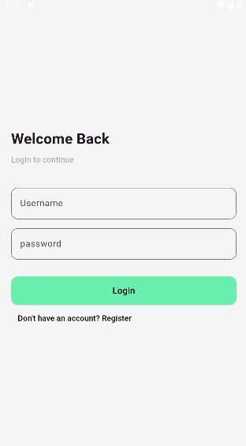
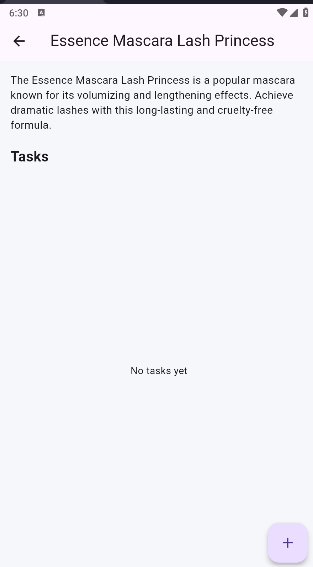
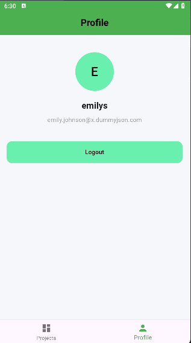

# 🗂️ Task Manager App

> Developed as part of a Flutter Technical Assessment.

A Flutter mobile application that allows users to authenticate, manage projects, create tasks, and handle profile settings using Clean Structure and BLoC state management.

---

## 🚀 Features

### 🔐 Authentication
- Login screen (Username & Password)
- Registration screen (Name, Email, Password)
- JWT token storage using SharedPreferences
- Auto-login if token exists
- Logout functionality

### 📋 Projects
- Fetch projects from REST API (DummyJSON)
- Display project title, description, and status
- Pull-to-refresh support
- Loading and error state handling
- Clean modern UI

### 📂 Project Details
- View project details
- Add new tasks
- Mark tasks as done
- Task priority (Low / Medium / High)
- Dynamic state updates using BLoC

### 👤 Profile
- Display logged-in user name and email
- Logout functionality

---

## 🏗️ Architecture

The project follows a **Feature-Based Structure** with separation of concerns:
lib/
├── core/
│ ├── network/
│ ├── widgets/
│
├── feature/
│ ├── auth/
│ ├── projects/
│ ├── tasks/
│ ├── profile/
│ ├── root/

text


### Layers:
- UI Layer (Screens & Widgets)
- Business Logic Layer (BLoC)
- Data Layer (Repository & Remote Data Source)

State management is handled consistently using **flutter_bloc**.

---

## 🛠️ Tech Stack

- Flutter (latest stable)
- Dart
- flutter_bloc
- Dio (HTTP client)
- GoRouter (Navigation)
- SharedPreferences (Local storage)
- Logger (Debug logging)

---

## 🌐 API Used

- Authentication:  
  https://dummyjson.com/auth/login  

- Projects:  
  https://dummyjson.com/products  

- Register (Mock):  
  https://dummyjson.com/users/add  

---

## 📱 Screens

- Splash Screen
- Login Screen
- Register Screen
- Projects Screen
- Project Details Screen
- Profile Screen

---

## 📸 Screenshots

(Add screenshots inside `assets/screenshots/` folder)
assets/screenshots/
├── login.png
├── projects.png
├── details.png
├── profile.png

text


Then reference them like this:

```markdown




▶️ How to Run
Clone the repository:
text

git clone https://github.com/deboashraf/task-manager-app.git
Navigate into the project:
text

cd task-manager-app
Install dependencies:
text

flutter pub get
Run the app:
text

flutter run

🧪 Test Login Credentials
text

username: emilys
password: emilyspass
📦 APK / Demo
Release APK or screen recording is attached with the submission.

📌 Notes
DummyJSON API is used as a mock backend.
Registration is simulated because the API does not return a real JWT.
The focus of this task is clean architecture, state management, and UI structure.
👨‍💻 Author
ِAbdallah Ashraf
Flutter Developer